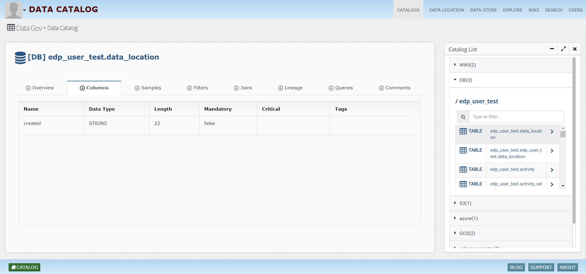
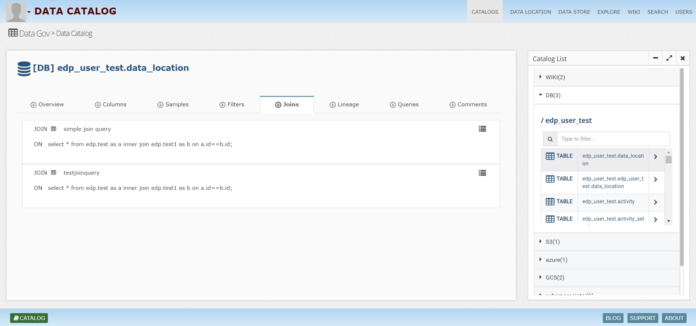
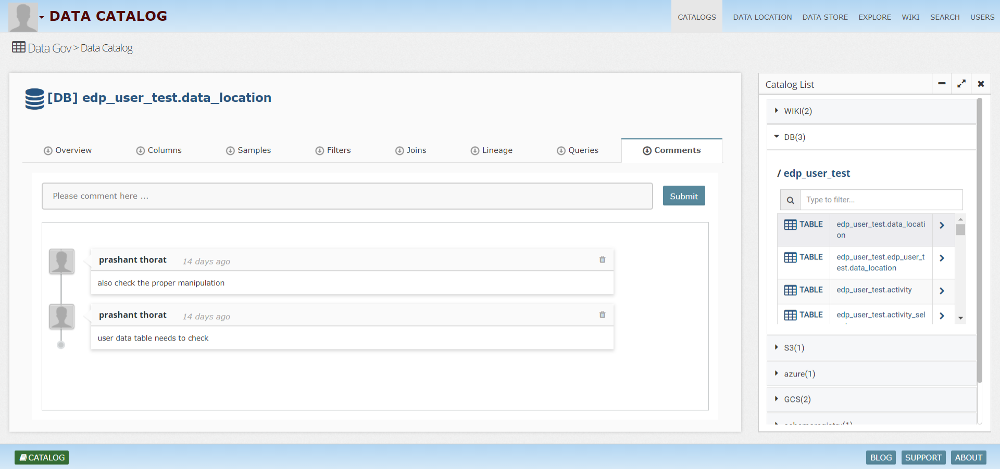
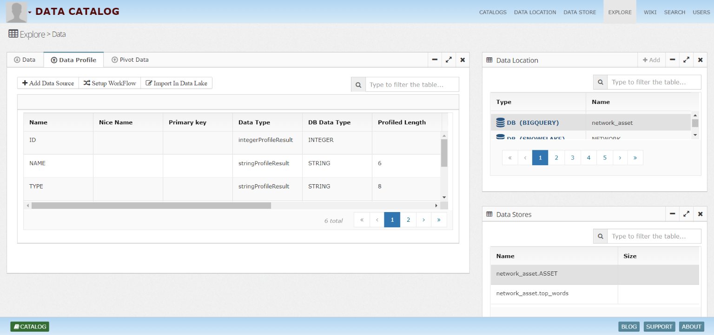

What is InsightLake Data Catalog?
-----------
If you need to shop something then you go to a store or website. You can easily search a product by its name, or features. You can also navigate through categories to reach to the right set of products. Businesses catalog their products to make discovery easy. They also recommend similar or linked products to improve user experience.

Now if we take the same example for data lakes, where many structured, unstructured data sets are stored and are growing rapidly. Manually building a catalog for these big data sets is a very costly and time consuming process. Many times its hard to find right people to know about the field level details. Without data catalog its very hard for business or data scientists to discover or understand data. They will have to rely on manual discovery.

Companies should setup an automated & curated governed process to build an approved business data catalog, which builds trust in the organization.

InsightLake Data Catalog solution unlocks the value of enterprise data lakes by building self service & governed centralized data catalog. It enables business users and data teams to find information easily.

It allows companies to discover & enrich technical or business metadata, automatically annotate or tag data sets, curate and store metadata within data or externally. It also allows easy data exploration, collaboration and business information creation at various levels like domain, store, field or cell.

InsightLake solution leverages machine learning & business curation to automatically catalog data assets in Big data environment with governed process.

## Information Catalog
Information catalog provides information about what data is available to business or data users, who owns the data, source of data, linked data sets, semantic meaning of data etc.

Information catalog helps companies to share governed and curated data between various teams and make it more data driven.

## Architecture

## Catalog Process
Information catalog process starts with defining enterprise standards around tagging, data domains, business context, data owners and glossary.

After setting up proper controls, process starts with data discovery.
Analysts can register data locations (relational DBs, Hadoop etc).
Automated profiling, classifications and tagging enriches the metadata. Relationships are searched and catalogs are linked.
Enriched metadata is made available to data stewards for curation and business approval.
After approval catalog information is stored in search database for easy exploration.
Information catalog process is an iterative process. It establishes business context for data assets and captures information like origin, transformations, consumers etc. It defines the semantic meaning of data using business terms. It also monitors changes to information catalog and provides a bridge between technology and business.

## Virtual Catalog
Data catalog solution enables companies to build catalog from various data sources like Relational databases, Hadoop, File systems etc. It indexes data, extracts information and adds a metadata information layer to build a rich information catalog.

## Data Glossary
Allows business to define business terms and higher level rules.

## Discovery
Data catalog solution allows easy discovery of data. Using intuitive UI an analyst can register data source and discover data sets.

## Automated Tagging/Annotations
InsightLake automatically profiles the data and links it with appropriate data domain hierarchies. It also classifies data using various tags. It uses machine learning and semantic topic models to do data classifications.

## Data Lineage

## Data Relationships
Data can come from various sources but some may be linked. InsightLake profiles the data sets and discovers the relationship between them. It shows linked data sets in the search results.

## Data Store
InsightLake stores data catalog in Lucene based search stores like Elastic Search or SOLR. Audit logs for the catalog changes are also stored for compliance.

## Governance
InsightLake enables governance by allowing teams to follow approval process, by capturing data lineage and ensuring appropriate data usage for sensitive data. Solution integrates with Cloudera Navigator and Hortonworks Atlas for data lineage.

Simple UI enables data stewards and business analysts to manage rules, roles and data access. Sensitive data is automatically tagged and access policies are defined.

## Curated
InsightLake allows business and data stewards to validate, approve and curate information about data. Easy to use approval process establishes governed process to build trust and consistency about data.

## Self Service
Easy to use search UI allows exploration of data catalog using keywords and tags. It also allows filtering based on various facets or data hierarchies.

It enables external applications to use REST APIs for catalog exploration. It allows teams to collaborate and enrich information about data.

## Benefits of Information Catalog
Clear business context based insight, which will speed up realization of value and reuse.
Collaboration and better information sharing between various teams, which makes trusted data available with continuous enrichment.
Enables better information lifecycle (archival, dictionaries, retention)
Builds regulated and governed data assets
Conclusion
Companies can leverage information catalog to setup a data driven process, optimize information flow and usage and maximize business value. Information catalog will allow various stakeholders to collaborate more easily and bring value from data faster.

# InsightLake Data Catalog Views

## Global Search
Search view enables Catalog users to search data sets using specific criterios like table name, database names or any free text.
Powerful search backend retrieves the results very fast ordered with the right relevance.

 
 
### Article/Wiki 
  Data stewards can create wikis about data sets to provide users more information about the data, historical changes and current usage. Catalog users can also look at sample data, reports etc.
  
 
 
### Data Location
 Location view enables users to view details about higher level data containers and systems like databases, buckets etc.
 

 
### Data Store
 Store view enables users to view details about data stores like tables, files, topics, indexes etc.

 
 
### Data Store Fields/Columns
  Users can see the field level details about a data store.

 

### Sample Data
 Users can see data samples based on their access permissions.
 

### Joins
 
 

### Data Lineage
 
 

### Queries
 Users can query the data using an intuitive query builder tool, which enables users without SQL knowledge.
 
 
### Comments
 Comments view provides a collaborative place for users to comment about the data sets. 
 
 
### Schema
 In case of non relational schema oriented data stores like Kafka, users can see the schemas in this view.
 
 
 
 
 
 ## Explore Data 
   Data catalog enables data exploration of structured and unstructured data in an intuitive way. Users can view structured data from databases, files (CSV, JSON) or unstructured data like images, videos, audios, documents.

Bellow are some of the examples:

  ### Structured Data
  
 
 
 ### Data Profile View
  Shows data profile, which includes data types and distribution.

 
 
 ### Pivot Data View
  For easier exploration Pivot view is provided

 
 
 ### Image View
  
 
 
 ### Video View
  
 
 
 ### Audio View
  
 
 
 
## Users
 Administrators can manage users, groups and roles to enforce role based access control.
  
 
## Wiki
  
 
 
 ## Wiki Summary
  
 

 ## Wiki Tables
  
 
  
 ## Wiki Queries
  
 
  
 ## Wiki Reports
  
 
 
  ## Data Location
 
 
 
  ## Data Store
 
 
 
To learn more, check out [http://www.insightlake.com/data-catalog.html](http://www.insightlake.com/data-catalog.html)

Installation
------
* Download or clone the repository. 
* Run bin/insightlake command.
* Open browser with URL as http://localhost:8080/
* Change configuration in /conf folder to set different ports
* By default H2 database is used, you can change the database details in jdbc.properties file

Installation using docker 
------
* Download or clone the repository. 
* cd /docker
* Run `docker-compose -f docker-compose.yaml up --build`
* Open browser with URL as http://localhost:8080/

License
------
InsightLake Data Catalog is a commercial product but distributed to be used freely. Please contact contact@insightlake.com for details.

Getting Help
----------

You can get help easily :
Community - Google Groups
Slack Channel
Twitter
Facebook
Email: contact@insightlake.com

